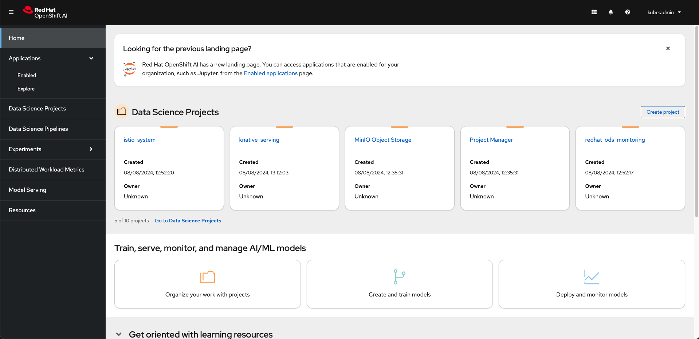
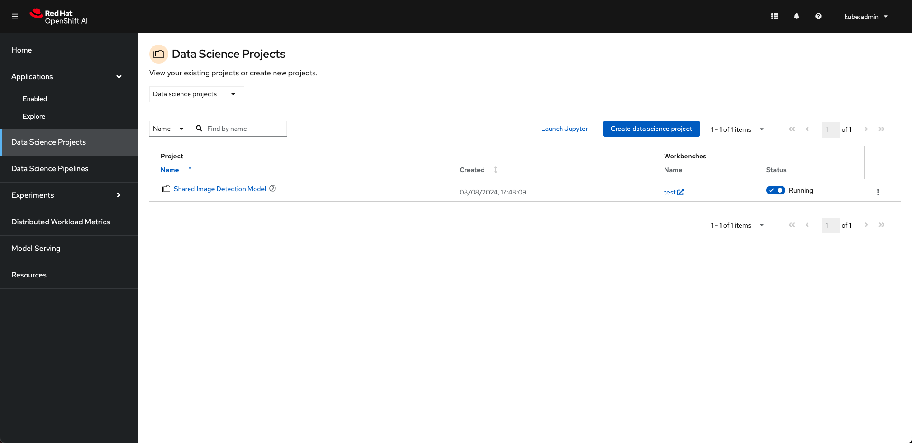
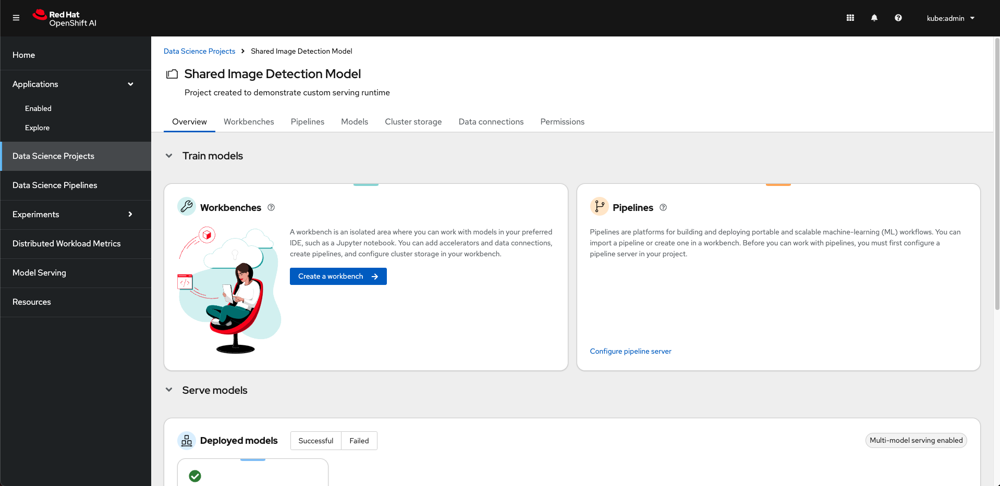
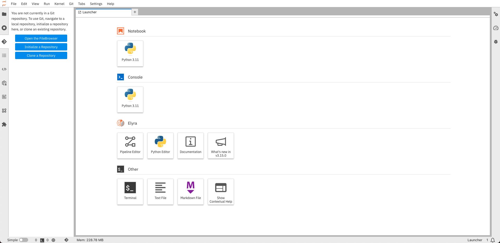

<u>Things to automate</u>

Enable Azure OpenAI, Add to code and import one of the keys and the endpoint into the workbench as a variable

Enable Azure AI Search, with private end point, pass details back to the code base automatically

Pages that need the details
- 02-05 - comitted some code to test by currently throwing a permission error

# Get demo code running
install gitops operator

install OpenShift AI

install pipelines?

give gitops more access (this needs to be refined)

```yaml
apiVersion: rbac.authorization.k8s.io/v1
kind: ClusterRoleBinding
metadata:
  creationTimestamp: null
  name: cluster-admin-0
roleRef:
  apiGroup: rbac.authorization.k8s.io
  kind: ClusterRole
  name: cluster-admin
subjects:
- kind: ServiceAccount
  name: openshift-gitops-argocd-application-controller
  namespace: openshift-gitops
```

oc apply -f ./bootstrap/applicationset/applicationset-bootstrap.yaml

Check out argocd to make sure all applications get deployed

open up the openshiftAI console, things look different compared to the instructions due to the new interface



Follow the instructions, selecting "Data Science Projects" there should be "Shared Image Detection Model" link



hit the link and it takes you through to the over view page



Hit create workbench, add a name, select image as "CUSTOM - Insurance Claim Processing Lab Workbench" hit create work bench. Wait for status to change to "Running" and the Open text to be come a link, click to access the workbench

This should show an empty jupiter notebook, hit the git symbol on the left menu and select Clone a repository


Put the URL in, tick download the repository and hit clone, open the parasol-insurance folder and then open the lab-material folder. finally open the 02 folder.

At this point we are into following the current demo flow https://rh-aiservices-bu.github.io/parasol-insurance/modules/02-02-auto-created-project.html 

removed the endpoints not being used, added a check for Azure OpenAI but its throwing a permission error for me. Needs an additional check for AI Search endpoint